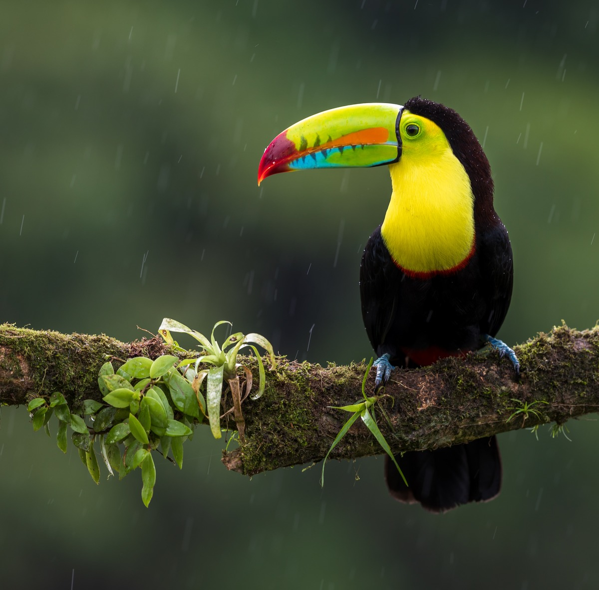
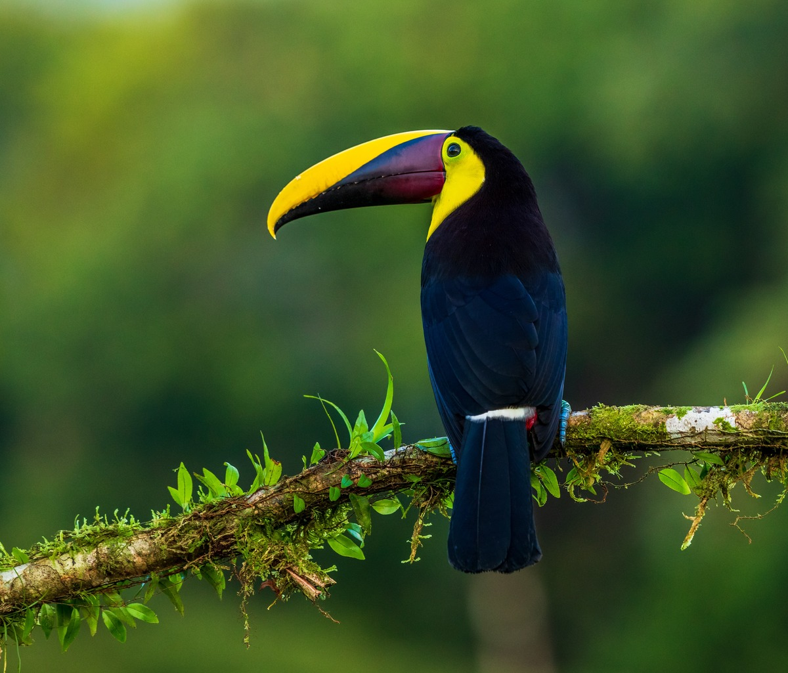
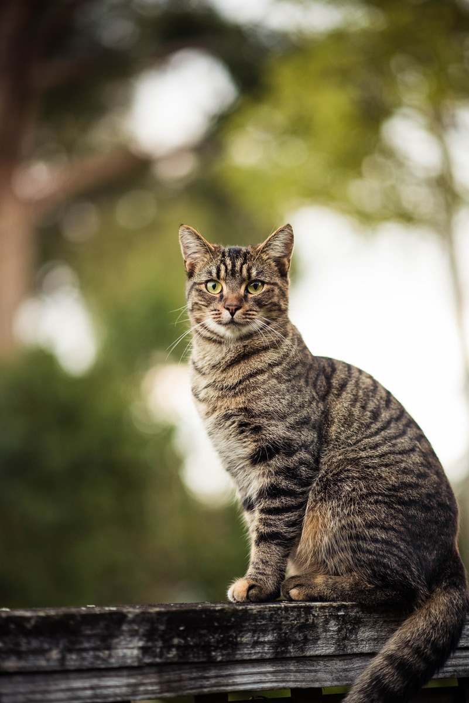
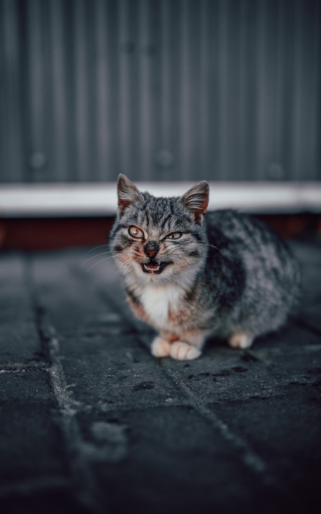
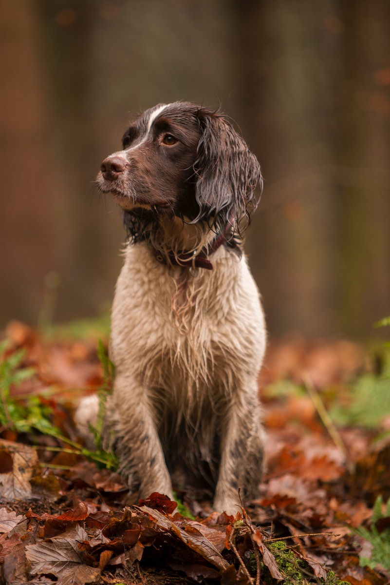
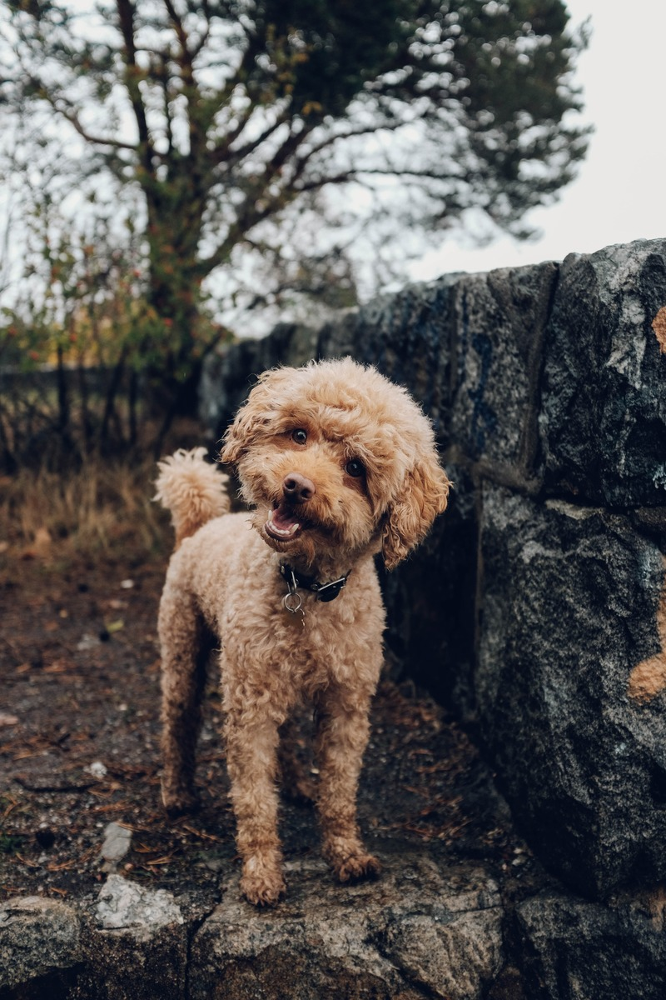
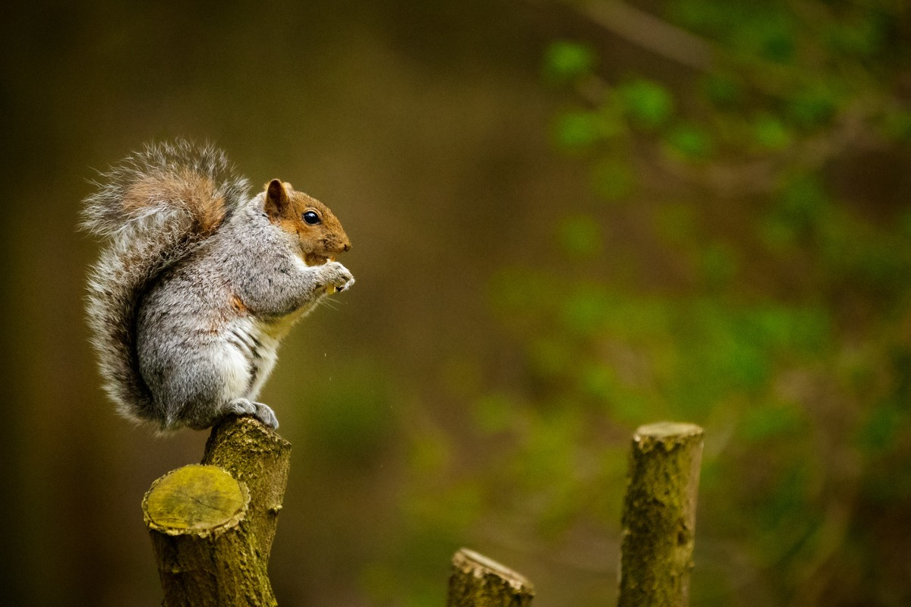

# AWS : S3 Notification + Rekognition + ImageMagick

Detect **Bird**, **Cat** and **Dog** in images with **Rekognition** then draw the bounding box with **ImageMagick**.

Photo by [Zdeněk Macháček](https://unsplash.com/@zmachacek) on [Unsplash](https://unsplash.com/photos/eqXiLNfZDc0)

Photo by [Zdeněk Macháček](https://unsplash.com/@zmachacek) on [Unsplash](https://unsplash.com/photos/cfIcTiopin4)

Photo by [Zane Lee](https://unsplash.com/@zane4004) on [Unsplash](https://unsplash.com/photos/VvTVkc_p-eg)

Photo by [Vadim Sadovski](https://unsplash.com/@vadimsadovski) on [Unsplash](https://unsplash.com/photos/Ri8c2qFg32A)

Photo by [Andrew Whitham](https://unsplash.com/@andyw101) on [Unsplash](https://unsplash.com/photos/_NArzwph68g)

Photo by [Fredrik Öhlander](https://unsplash.com/@fredrikohlander) on [Unsplash](https://unsplash.com/photos/tGBRQw52Thw)

Photo by [Shane Young](https://unsplash.com/@shane_young) on [Unsplash](https://unsplash.com/photos/S7fRAd0oTPI)

