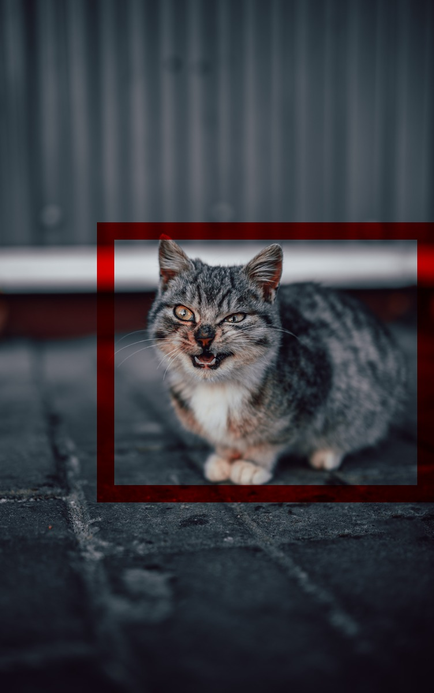

# AWS : S3 Notification + Rekognition + ImageMagick

Detect **Bird**, **Cat** and **Dog** in images with **Rekognition** then draw the bounding box with **ImageMagick**.

### Exemples

### Thanks

[Several photographers on Unsplash](uploads/readme.md)